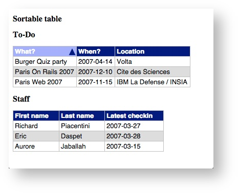
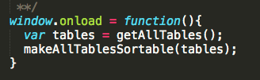

#Homewrok 02. Table Sorter
Table sorter包括JavaScript和一点CSS，能够让原始的html table变得可以分别按照各栏数据值，对各行排序。

##效果

1. 在表头任意一个栏目中点击一下，下面各行将按照此栏目值的升序排序(按照字符串比较来确定顺序)
2. 再次点击该栏目，变更为降序排序
3. 点击其它栏目，则按其它栏目的值重新排序
4. 注意，排序时，栏目奇偶行的背景色保持奇数白色、偶数浅灰色

##要求

1. 不能改动原html，只能够添加js和css文件
2. 不能使用任何类库，只能用原生DOM API
3. JavaScript必须模块化，JS的调用入口，必须按照下面的图示： 
  也就是说，JS中要完成makeAllTablesSortable(table-doms) 方法，该方法接受一组普通table DOM元素，将它们全部变成sortable

##附加要求
还可以尝试用这个makeAllTablesSortable，使其它网页的table变得sortable。具体做法是打开一个有table的网页，开启控制台，然后在控制台中执行你的makeAllTablesSortable方法，看看能否将tables变得sortable。

##重点
1. JavaScript基本语法
2. 程序的模块化设计
3. DOM 
4. DOM Event

##已改进的问题
1. 不直接在js里面改变样式，采用给元素属性赋值方式从而间接在css中修改样式的方案。
2. 修改且完善了一些注释和格式的问题。

##未改进的问题
1. 兼容问题。仍未想出较好的方案从而兼容其他网站不同格式的table，例如表头表格也是tr的table。

